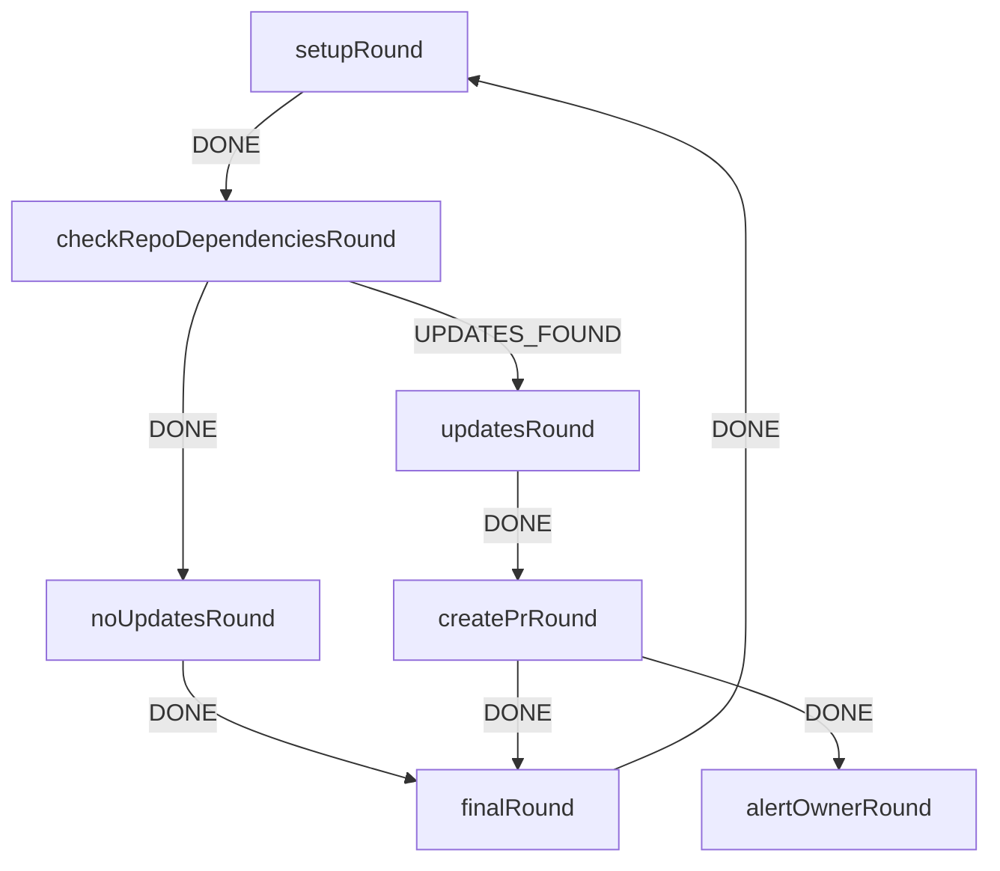

# Updating Dependencies

Updating hthe depenedncies of autodev projects is handled simply and easily by the `adev` applciation.



The above command fsm represents the necessary flwo to perform the the updates manually.

Effectively the necessary steps are;

1. checkout main

2. run the following command;

```bash
adev deps bump --latest --strict
```
