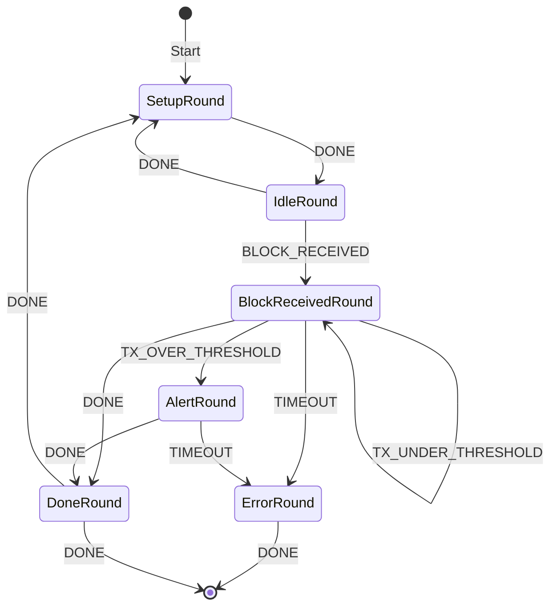

# Guide: Creating a Whale Watcher Agent

This guide walks you through creating a whale watcher agent that monitors blockchain transactions for transfers.

**Note**: Replace `author` in the commands below with your author name (e.g., alice, bob, etc.)

## 1. Create the FSM Definition

First, create a Mermaid diagram to visualize the FSM. Create `whale_watcher_diagram.mmd`:



This diagram represents the following states and transitions:
- `SetupRound`: Initial setup and configuration
- `IdleRound`: Waiting for new blocks
- `BlockReceivedRound`: Processing a new block's transactions
- `AlertRound`: Handling whale transactions
- `DoneRound`: Completed processing
- `ErrorRound`: Error handling state

Now convert the Mermaid diagram to FSM specification:

```bash
adev fsm from-file whale_watcher_diagram.mmd WhaleWatcherAbciApp --in-type mermaid --output fsm_spec > whale_watcher_fsm.yaml
```

This will create `whale_watcher_fsm.yaml` with the FSM specification that includes:
- Input alphabet (events like BLOCK_RECEIVED, TX_OVER_THRESHOLD)
- States and transitions
- Start and final states
- Complete transition function

## 2. Create Agent from FSM

Generate the initial agent structure from the FSM definition:

```bash
adev create_from_fsm author/whale_watcher whale_watcher_fsm.yaml
```

## 3. Add Required Components

Install the necessary contract and connection:

```bash
cd whale_watcher
aea add connection bafybeigntoericenpzvwejqfuc3kqzo2pscs76qoygg5dbj6f4zxusru5e
aea add contract bafybeigovz3fg5g46f5geyy33fpvuof3ewktslxswipk37fqpmfj42uysi
```

## 4. Eject and Customize the Skill

```bash
adev eject skill author/whale_watcher_abci_app author/whale_watcher_abci_app
```

## 5. Implement the Components

Create the following files in your skill directory:

- `behaviours.py`: Implements the FSM behavior states
- `dialogues.py`: Handles dialogue management
- `handlers.py`: Implements message handlers
- `skill.yaml`: Configures the skill components

## 6. Publish the Agent

```bash
cd whale_watcher
adev publish author/whale_watcher --force
```

## 7. Run the Agent

```bash
cd ..
adev run dev author/whale_watcher --force
```

## 8. (optional) convert the agent to a service

```bash
adev convert author/whale_watcher author/finished_whale_watcher
```
and then run it

```bash
autonomy generate-key ethereum -n 1 

adev run prod author/finished_whale_watcher
```

To see the complete implementation, you can fetch the finished agent:

```bash
aea fetch bafybeicr5wi5r4f272rxybgb4jcpksnylktm5qnzi3ldltbdxnjk4yq24e
```