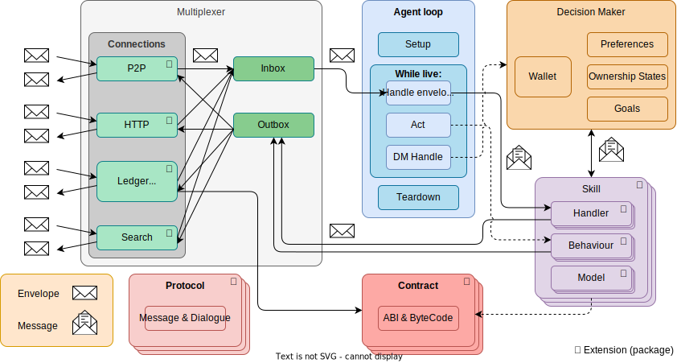
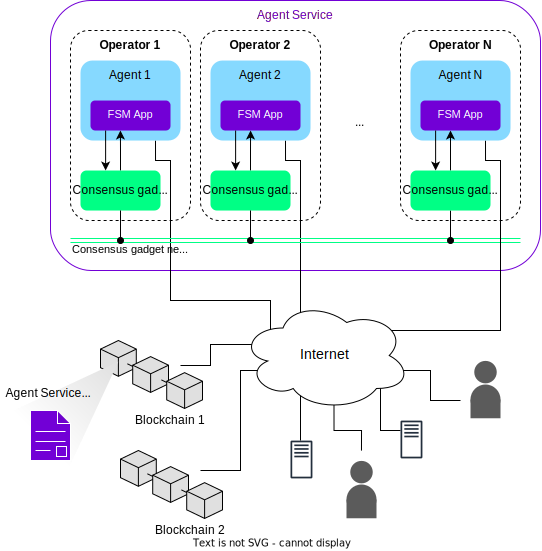

auto_dev is a library built on top of [Open Autonomy](https://docs.autonolas.network). Open Autonomy is a decentralized protocol that helps automate complex operations on blockchain networks. Think of it as a way to create and manage smart AI agents that can work independently or together to perform various tasks. The protocol is built on two main frameworks: Open AEA and Open Autonomy.

## Open AEA: Your Individual AI Agent

The [Autonomous Economic Agent](https://open-aea.docs.autonolas.tech){target="_blank"} (AEA) framework is like a toolkit for building individual smart agents. Think of an AEA as your personal AI assistant that can handle economic tasks without constant supervision.

Here's what makes up an individual agent:

### 1. **Agent Framework & Decision Maker**
- The "brain" of your agent
- Manages goals and preferences
- Controls the wallet
- Decides what actions to take

### 2. **Skills**
Like apps on your phone, skills give your agent different capabilities:
- **Handlers**: React to external events (like responding to messages)
- **Behaviors**: Take proactive actions (like scheduling regular tasks)

### 3. **Communication Tools**
- **Envelopes**: Special containers for messages between agents
- **Protocols**: Rules for how agents talk to each other
- **Connections**: Ways to connect with other agents and external services

### 4. **Contracts**
Smart contracts that define the rules your agent follows when interacting with blockchains

## Open Autonomy: Your Decentralized Automated Business

The [Open Autonomy framework](https://docs.autonolas.network){target="_blank"} helps you organize multiple agents to work together, like running an automated factory. It's built for creating decentralized services that can:
- Run continuously without central control
- Make group decisions through consensus
- Handle complex operations that smart contracts can't do alone

### Key Components

1. **Agent Services**: Groups of agents working together off-chain
2. **Registry Contracts**: Think of these as the employee directory:
   - **Component Registry**: Lists available tools (like HTTP servers, smart contracts, APIs)
   - **Agent Registry**: Lists different types of agents and their capabilities
   - **Service Registry**: Lists available services and their agent teams

3. **Support Systems**:
   - **Event Listener**: Watches the blockchain for important events
   - **Task Scheduler**: Manages when agents should perform tasks
   - **Monitoring**: Tracks how well everything is working

## Real World Example: Price Oracle Service

Here's how both frameworks might work together in a real application:

1. **Individual Agent (Open AEA)**:
   - Fetches price data from exchanges
   - Manages its own wallet
   - Communicates with other agents

2. **Service (Open Autonomy)**:
   - Multiple agents collect prices from different sources
   - Agents reach consensus on the correct price
   - Service submits agreed price to blockchain
   - Handles agent failures automatically
   - Distributes rewards to operators

Now that you know this, [lets get started!](https://8ball030.github.io/auto_dev/installation)
